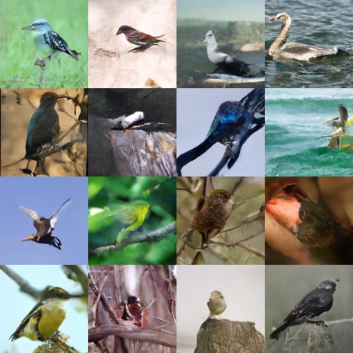
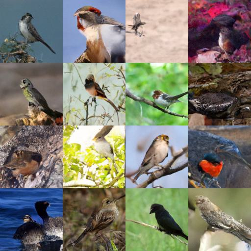
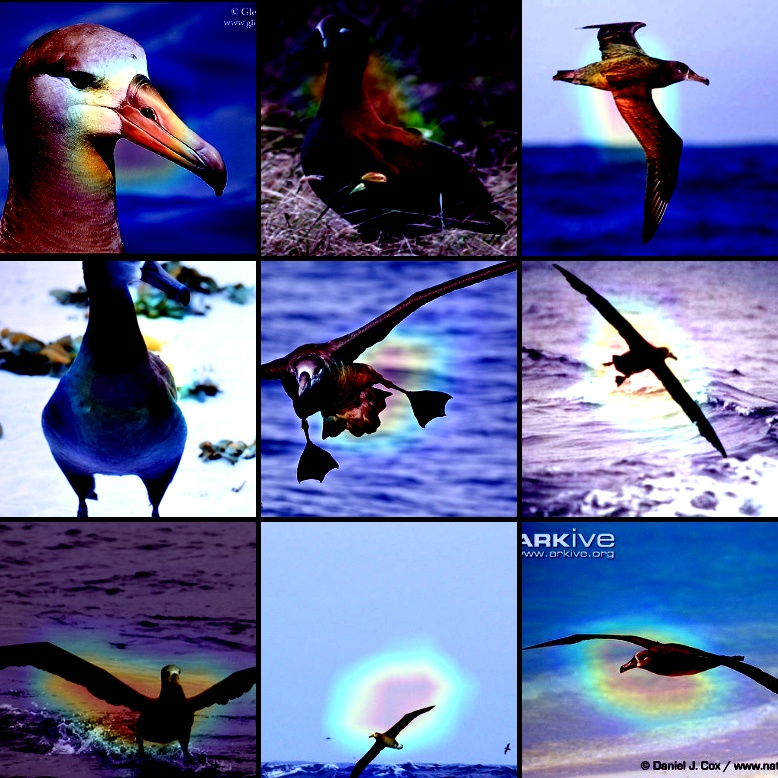
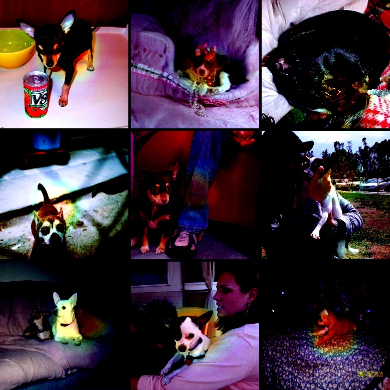

# 人工神经网络课程实验结果

## 1.各种训练技巧来提高模型性能

### 1.探究超参数对模型性能的影响

使用网络：resnet50
batch_size = 64
lr = 1e-3
迭代次数：100
数据集：CUB_200_2011

#### a.迭代次数的影响

| 迭代次数 | 训练集准确率 | 测试集准确率 |
| ---- | ---- | ---- |
| 50 | 0.9671 | 0.2755 |
| 100 | 0.9992 | 0.2796 |
| 150 | 0.9981 | 0.2963 |

#### b.batch_size的影响

| batch_size | 训练集准确率 | 测试集准确率 |
| ---- | ---- | ---- |
| 32 | 0.9610 | 0.2900 |
| 64 | 0.9967 | 0.2796 |
| 128 | 0.9933 | 0.2965 |

#### c.初始学习率的影响

| ini_lr | 训练集准确率 | 测试集准确率 |
| ---- | ---- | ---- |
| 1e-3 | 0.9992 | 0.2796 |
| 5e-4 | 0.9971 | 0.3188 |
| 1e-4 | 0.9819 | 0.2415 |

### 2.探究数据增强对模型性能的影响

使用网络：resnet50
batch_size = 64
lr = 1e-3
迭代次数：100

| 数据增强方式 | 训练集准确率 | 测试集准确率 |
| ---- | ---- | ---- |
| 不使用 | 1.0000 | 0.2082 |
| 随机裁剪 | 0.9992 | 0.2796 |
| 随机翻转 | 0.9992 | 0.2774 |
| 随机改变亮度，对比度和饱和度 | 0.9990 | 0.2245 |
| 随机擦除 | 0.9801 | 0.2308 |
| 随机裁剪 + 随机翻转 | 1.0000 | 0.2982 |
| 随机裁剪 + 随机翻转 + 随机擦除 | 0.8795 | 0.2765 |

可以看到，如果数据增强的方法运用的过于强烈，可能回导致模型在训练时无法收敛，影响模型的泛化能力，可能需要更深的模型结构才能获得更好的性能。

### 3.探究优化器的选择对模型性能的影响

使用网络：resnet50
batch_size = 64
lr = 1e-3
迭代次数：300

由于SGD优化器对于较小的学习率可能无法收敛，因此这里增大了SGD优化器对应的学习率。

| 优化器 | 训练集准确率 | 测试集准确率 |
| ---- | ---- | ---- |
| SGD(lr:0.1) | 1.0000 | 0.4035 |
| Adam | 0.9996 | 0.3870 |
| AdamW | 0.9992 | 0.3354 |

从结果可以看出，使用SGD能够更加灵活地调整学习率，虽然收敛速度相比Adam方法更慢，但是最终模型的性能较Adam方法更好。
通过实验发现，Adam方法在训练的后期学习率太低，在前期收敛的太快，容易陷入局部最优，影响了模型的性能，所以在本次实验中，SGD方法效果更好。

## 2.迁移学习

使用预训练模型的权重来进行迁移学习
使用网络：resnet101
batch_size = 64
lr = 5e-4
迭代次数：100

| 迁移学习使用策略 | 训练集准确率 | 测试集准确率 |
| ---- | ---- | ---- |
| 不使用 | 0.9917 | 0.3328 |
| 训练layer4以及后面的层 | 1.0000 | 0.7063 |
| 训练layer3以及后面的层 | 1.0000 | 0.7125 |
| resnet152，训练layer4以及后面的层 | 1.0000 | 0.7004 |

可以发现，使用Transfer Learning训练可能不能达到比较好的效果，当我们只冻结预训练网络的前面几层，训练网络的最后三层的时候，发现模型能够更快速的收敛，并且能够达到较高得正确率，并且训练速度相比与不使用预训练模型来说更加快速，参数量更少。

## 3.图像生成

使用GAN来生成图像
在训练过程中，我们发现当判别器和生成器的学习率相等时，会出现判别器的收敛速度快于生成器的形况，导致生成图像的质量较差
我们尝试降低判别器的学习率，提高生成器的学习率，发现判别器和生成器的收敛速度较为均衡，但是可能由于训练次数较少，导致生成的图像质量也不是很理想

因此，我们尝试使用diffusion模型来生成图像，利用diffusers库中的DDPM方法来训练diffusion模型，生成分辨率为128的图像，经过400个epochs之后，结果如下：

可以看到，使用diffusion模型，可以在较短的时间内生成有意义的图像，并且图像的质量较高，同时，diffusion模型在训练中的稳定性也比GAN模型更好，但是由于diffusion模型的训练和生成过程涉及添加噪声和去除噪声的过程，因此更加消耗计算资源，生成速度较GAN模型更慢。因此，diffusion模型更加适用于生成高质量以及细节丰富的图像。

## 4.对比CNN模型和ViT模型

参数：
batch_size = 64
lr = 1e-4
迭代次数：100

对比各类Resnet模型和ViT模型的参数量以及再CUB_200_2011数据集上训练的收敛速度，结果如下：
|模型| 参数量 |
| ---- | ---- |
|vit_b_16| 85952456 |
|resnet50| 23917832 |
|resnet101| 42909960 |

（放两张图，对比一下resnet101和vit_b_16的收敛速度）
从上表中可以看出，ViT模型的参数量普遍大于resnet模型，这样也导致了在相同的迭代次数之下，ViT模型的收敛速度远比resnet模型要慢，并且训练时间也要更长，在本次实验中，由于vit_l_16模型的参数量过大，导致CUDA内存溢出
ViT是一种基于自注意力机制的模型，具有全局感知的特性，并且ViT模型的自注意力机制不容易实现并行计算，因此在训练过程中需要更长的时间
因此，从总体来看，ViT模型与CNN模型相比，具有更大的参数量，并且收敛速度更慢，训练时间更长，但是同时也拥有了CNN模型所不具备的全局感知特性，能够获取更多的上下文信息。同时，ViT无法利用图像本身具有的尺度、平移不变性和特征局部性等先验知识，必须使用大规模数据集学习高质量的中间表示，适合用于数据集规模较大的场景。因此，当数据集规模较大，并且训练资源较为充足的时候，使用ViT模型可能会获得更好的性能，而当数据集规模较小，或者训练资源有限时，使用CNN模型可能效果更好。

由于vit模型参数量较大，而计算资源有限，因此我们尝试使用预训练好的vit模型进行迁移学习，将预训练的vit模型与预训练的resnet模型效果进行对比，结果如下：

|模型| 训练集acc | 测试集acc |
|---- | ---- | ---- |
| vit_b_16没有冻结 | 1.0000 | 0.7510 |
| vit_b_16微调两个encoder层 | 0.9965 | 0.7332 |
| vit_b_32微调两个encoder层 | 0.9988 | 0.6018 |
| vit_l_16微调两个encoder层 | 1.0000 | 0.6800 |
| resnet152没有冻结 | 1.0000 | 0.7335 |
| resnet152微调layer3以及后面的层 | 1.0000 | 0.7063 |

通过上面的结果可以看到，使用预训练的vit模型进行迁移学习可以达到比较好的效果，由于在本次实验中使用的CUB_200_2011数据集的规模较小，因此可能无法充分发挥vit模型在大规模数据集上的优势。因此，我们可以使用预训练的vit模型进行迁移学习，以此来弥补计算资源的不足，并且达到较好的效果。
同时，对比resnet模型和vit模型，可以看到resnet模型在中等规模数据集上表现稳定，更容易收敛，而vit模型则需要更多的参数来进行学习，收敛速度较慢，并且在小规模数据集上表现较差，需要大量的数据来进行训练。

## 5.VLM

VLM模型通过从互联网上大量的图像-文本对中学习到丰富的视觉-语言关联，能够在只使用单一VLM模型的情况下实现对各种视觉任务的zero-shot迁移，在本次实验中，我们使用已经在大规模的数据上预训练好的OpenCLIP模型，并将其零样本迁移到CUB_200_2011数据集的分类任务上

我们先从CUB_200_2011数据集中抽取一张图片，利用VLM模型进行零样本分类，预测结果如下：
选取的图片：
(放一张鸟的图片：VLM_bird_1.jpg)

| text | a photo of a cat | a photo of a dog | a photo of a bird |
| ---- | ---- | ---- | ---- |
| prob | 3.6384e-04 | 3.2859e-03 | 9.9635e-01 |

从prob中可以看出，VLM模型正确预测了这张图片的内容，并且没有经过额外的数据进行训练，因此可见VLM模型具有强大的泛化能力

我们采用VLM模型对CUB_200_2011数据集的前1000张图片进行Zero-shot分类，分类的准确率为：51.4%
从VLM模型在CUB_200_2011数据集上的分类准确率可以看出，VLM模型在分类任务上具有很好的泛化能力，在没有额外数据进行训练的情况下，仅使用预训练的模型，就能够在分类任务上达到一定的准确率。其强大的泛化能力可以让我们摆脱传统机器学习中对于大量人工标注数据的依赖，通过采用一种新的学习范式–无监督预训练、微调和预测，探索自监督学习，从无标签数据中学习有用和可迁移的表征，从而获得更好的性能

接下来我们使用CoOp方法，通过学习并优化prompts，使得CLIP模型能过够适配CUB_200_2011数据集上的分类任务，增强CLIP模型的泛化能力，结果如下：

zero-shot: acc: 51.4%

CLIP + CoOp(M=16):

| mode | class token position | acc |
| ---- | --- | --- |
| zero-shot | / | 51.4% |
| 1-shot | end | 45.70% +- 0.54% |
| 2-shots | end | 52.67% +- 1.84% |
| 4-shots | end | 58.43% +- 1.33% |
| 8-shots | end | 64.80% +- 0.14% |
| 16-shots | end | 69.87% +- 0.09% |
| 16-shots | middle | 70.87% +- 0.24% |
| 16-shots-CSC | end | 69.60% +- 0.33% |

可以发现，CoOp方法使得CLIP模型在分类任务上能够达到更好的泛化能力，并且能够通过学习并优化prompts，使得CLIP模型能够适应不同的数据集，从而获得更好的性能。

## 6.可解释性

我们采用CAM方法研究模型的可解释性，根据模型最后一层卷积层的输出特征生成热力图，以此来分析模型的作用原理

我们先采用性能较差的resnet50模型进行分析，结果如下：
我们选取第0类数据作为观测的样本
当模型预测正确时，生成的热力图如下：
(CAM_resnet50_predict_true_1.jpg)
(CAM_resnet50_predict_true_2.jpg)

当模型预测错误时，生成的热力图如下：
(CAM_resnet50_predict_false_1.jpg)
(CAM_resnet50_predict_false_2.jpg)

通过生成的热力图我们可以看到，虽然模型预测了正确的结果，但是从热力图的反馈可以发现，模型并没有提取到物体的关键特征，这一点从模型预测错误的情况下生成的热力图中也可以明显看出。我们可以发现，当前的模型更多关注的时鸟的脖子部分的信息，而不是鸟的头部，嘴巴等更关键的部位。因此，我们可能需要采用更复杂的模型来使得模型能够提取到物体的关键特征，从而提高模型的性能。

## 7.模型鲁棒性

我们尝试使用对抗攻击来评估模型的鲁棒性，利用torchattack库中集成的方法，对已经训练号的模型进行对抗攻击，观察模型在面对攻击时的表现
在本次实验中，我们使用PGD方法对模型进行攻击，采用的模型是微调后的resnet152模型，该模型在CUB_200_2011数据集的测试集上的准确率为0.7335，我们先对个别样本进行测试，结果如下：

(展示图片，PGD_Pair-0.png)
(展示图片，PGD_Pair-1.png)

可以观察到，攻击前后两张图像从肉眼上看并没有太大差异，但是模型在攻击后的图像上预测的类别发生了变化，这表明PGD攻击能够有效地破坏模型的鲁棒性，引导模型产生错误的结果

由于本次攻击的目标模型本身的准确率并不是很高，因此使用PGD方法对模型进行攻击时取得了显著的效果，在eps=8/255, alpha=2/225,迭代次数为5次的情况下，就能够将模型的准确率从0.7335下降到0.0，因此，我们在训练模型的过程中需要加强对模型鲁棒性的关注，以保障模型的安全性和稳定性。

## 8. Empirical evaluation

### 1. Introduction

In this section, we present a comprehensive empirical evaluation of our proposed ResNet-50 based classification model. We conduct experiments on two benchmark datasets, CUB-200-2011 and Stanford Dogs, to demonstrate the robustness and effectiveness of our approach. Additionally, we perform hyper-parameter sensitivity analysis to understand the impact of various hyper-parameters on the model's performance.

### 2. Experimental Setup

#### 2.1 Datasets

- CUB-200-2011:
  - CUB-200-2011数据集包含200种鸟类，11788张图像
  - 数据预处理：图像缩放到256x256，随机裁剪到224x224，归一化到[0, 1]范围，数据增强包括随机水平翻转。
- Stanford Dogs:
  - Stanford Dogs 数据集包含120种狗类，20,580张图像。
  - 数据预处理：图像缩放到256x256，随机裁剪到224x224，归一化到[0, 1]范围，数据增强包括随机水平翻转。
  
#### 2.2 Implementation Details

- 环境设置：所有实验在NVIDIA V100 GPU上运行，使用Pyton3.7和PyTorch1.12.1。
- 模型参数：我们使用预训练的ResNet-50模型，超参数设置：初始学习率为0.01，批量大小为64，训练100个epoch。优化器使用SGD。

### 3. Results on Multiple Datasets

| Dataset       | Top-1 Accuracy |
|---------------|----------------|
| CUB-200-2011  | 73.68%          |
| Stanford Dogs | 83.63%          |

通过结果我们可以看出，再训练模型的过程中，样本数量更多的Stanford Dogs数据集的准确率更高，这表明，在训练模型时，样本数量更多的数据集能够获得更好的性能，对于样本数量较少的数据集，可能需要采用更多的数据增强策略来提高模型性能。

### 4. Hyper-parameter Sensitivity Analysis

#### 4.1 Learning Rate Sensitivity

实验设计：在不同的初始学习率(0.1, 0.05, 0.01)下训练模型，并比较模型的性能，结果如下：

| Learning Rate | Top-1 Accuracy (CUB-200-2011) | Top-1 Accuracy (Stanford Dogs) |
|---------------|-------------------------------|-------------------------------|
| 0.01           | 73.68%                         | 83.63%                         |
| 0.005          | 72.89%                         | 84.76%                         |
| 0.001          | 70.00%                         | 85.27%                         |

#### 4.2 Batch Size Sensitivity

实验设计：在不同的批量大小（32，64，128）下训练模型，并比较其在验证集上的表现。

| Batch Size | Top-1 Accuracy (CUB-200-2011) | Top-1 Accuracy (Stanford Dogs) |
|------------|-------------------------------|-------------------------------|
| 32         | 75.01%                         | 82.73%                         |
| 64         | 73.68%                         | 83.63%                         |
| 128        | 71.70%                         | 84.71%                         |

### 5. Ablation Study

#### 5.1 Hyper-parameter Tuning

我们尝试调整其他超参数，并且使用不同的网络结构，观察模型性能的变化

| Parameter        | Value | Top-1 Accuracy (CUB-200-2011) |
|------------------|-------|-------------------------------|
| Network Depth    | 50    | 73.68%                         |
| Network Depth    | 101   | 74.34%                         |
| Network Backbone | resnext50_32x4d | 74.56%                         |
| Network Backbone | wide_resnet50_2 | 74.82%                         |

### 6. Error Analysis

#### 6.1 Failure Cases

展示在CUB-200-2011和Stanford Dogs数据集上错误分类的样本图像，分析错误原因。

从上面展示出的错误分类样本图像可以看出，当前模型并不能够很好地识别出物体的细节特征，所关注的图像区域并不能很好地反映出从无地类别，并且对于动物的不同姿态以及复杂的背景，模型并不能做出很好的提取和识别，因此可能需要引入更复杂的模型结构，更强的特征提取器来提升模型的性能。

#### 6.2 Discussion of Limitations

当前方法训练出来的模型在对一些细节的识别上仍然存在不足，从两个不同数据集的对比来看，样本数量更多的Stanford_Dogs数据集的准确率更高，在训练模型时，样本数量更多的数据集能够获得更好的性能，对于样本数量较少的数据集，可能需要采用更多更有效的数据增强策略来提高模型性能。从超参数的敏感性分析中，我们发现，学习率以及batch_size的调整对模型性能的影响在不同的数据集上反映出了不同的结果，可能需要进一步的探索。同时，我们也发现，增大网络的复杂度，采用更加先进的模型能够提升模型的性能，因此，在今后可能的需要采用更加高级，更加复杂的模型结构，并且优化数据增强策略来进一步提升模型在细粒度分类任务上的性能。
